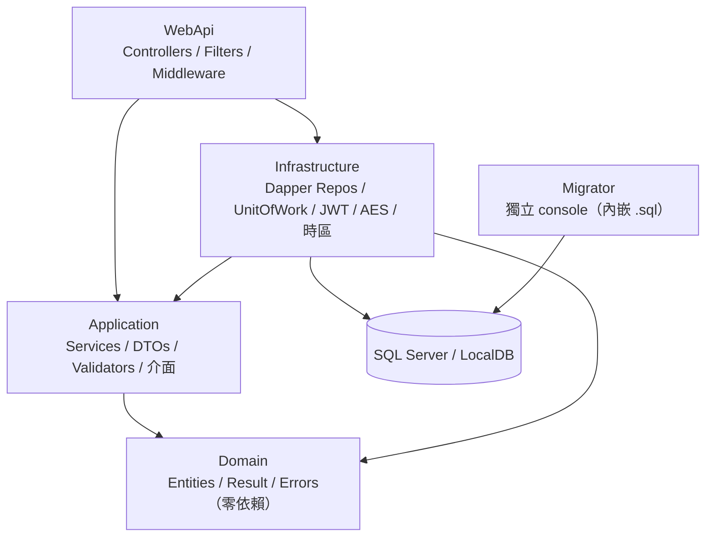
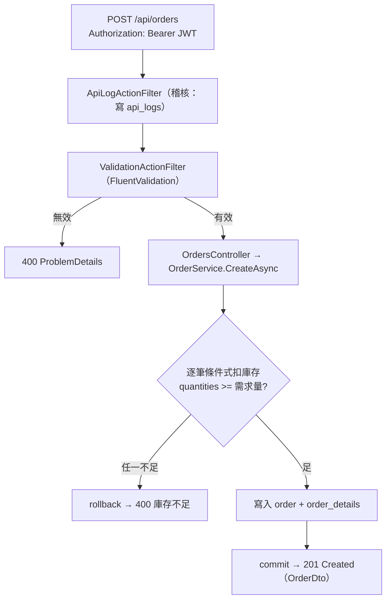

# Simple Northwind WebApi

.NET 8 + SQL Server 的後端 API（無前端）。員工密碼登入（JWT）、訂單 + 訂單明細 CRUD、客戶 CRUD、全 API 稽核記錄。建立訂單時扣減庫存、取消時還原；超賣會被拒絕；已付清訂單不可取消。

設計原則：**keep clean and simple** —— 無 MediatR、無事件驅動、不過度設計。

## 技術棧

| 類別 | 採用 |
|---|---|
| Framework | .NET 8（`global.json` 釘 SDK 8） |
| 資料存取 | Dapper（手寫 SQL，無 EF Core） |
| 資料庫 | SQL Server / 本機 LocalDB |
| 驗證 | JWT Bearer（PBKDF2 密碼雜湊） |
| 驗證規則 | FluentValidation |
| 機密 | AES-256-GCM（可逆機密）+ User Secrets（dev） |
| 日誌 | Serilog |
| API 文件 | Swashbuckle（Swagger，含 XML doc summary） |
| 測試 | xUnit + NSubstitute + Shouldly + WebApplicationFactory |

## 架構（Clean Architecture）

依賴方向：`WebApi → Application → Domain`、`WebApi → Infrastructure → Application/Domain`；`Domain` 不依賴任何層；`Migrator` 獨立。



## 請求流程（以建立訂單為例）



> 更新訂單（`PUT /api/orders/{id}`）採**樂觀並行 + no-op 偵測**：先比對 client 帶回的 `version`（不符 → 409），相符再判明細是否與現況相同（相同 → 400 未修改），否則更新（200）。

## 快速開始

```powershell
# 0) 本機第一次：設定 User Secrets（見下方「設定與連線字串」）

# 1) 建庫 + 套用 migration + 種子（idempotent，可重複跑）
dotnet run --project src/SimpleNorthwind.Migrator

# 2) 啟動 API（Swagger 於 /swagger）
dotnet run --project src/SimpleNorthwind.WebApi

# 3) 建置（TreatWarningsAsErrors，須維持零警告）
dotnet build SimpleNorthwind.sln

# 4) 測試（單元 + 架構 + E2E，須實際全綠）
dotnet test SimpleNorthwind.sln
```

## 測試帳號（種子資料）

| 欄位 | 值 |
|---|---|
| `employeeId` | `1`（Sales Manager） |
| `password` | `P@ssw0rd!` |

> 種子有 12 名員工（`employeeId` 1–12），**密碼皆為 `P@ssw0rd!`**（DB 內存的是 PBKDF2 雜湊，非明文）。登入：`POST /api/auth/login`，body `{ "employeeId": 1, "password": "P@ssw0rd!" }`。

## 資料庫與 Migrator

採**自製 `MigrationRunner`**（非 EF Core）：SQL migration 以 **embedded resource** 內嵌於 `Migrator.dll`。

```powershell
# 建庫（若不存在）+ 確保 schema_versions + 依檔名數字排序套用未執行的 migration + 種子
dotnet run --project src/SimpleNorthwind.Migrator
```

- migration 檔位於 `src/SimpleNorthwind.Migrator/Migrations/`：`0001` 建表 → `0002` PK/FK/CHECK/Index → `0003`–`0007` 種子 → `0008` 庫存校正 → `0009` api_logs 回應欄位。
- 全程 **idempotent**：已套用的版本（記於 `dbo.schema_versions`）會跳過，可安全重跑。
- 目標資料庫名取自連線字串的 `Initial Catalog`（單一事實來源）。

## 設定與連線字串（重要）

連線字串 / 機密**依環境分流**，**絕不入版控**：

| 環境 | `ASPNETCORE_ENVIRONMENT` | 連線字串 / 機密來源 |
|---|---|---|
| 本機開發 | `Development`（VS Debug 經 `launchSettings.json` 預設） | **User Secrets**（machine-local，不在 repo） |
| 正式 | `Production` | `appsettings.Production.json` 的 `enc:` AES-256-GCM 密文（啟動時 `PostConfigure` 解密） |

- `appsettings.json`（基底）：**不含**任何連線字串 / 機密。
- `appsettings.Development.json`：僅 Serilog 等級。
- `appsettings.Production.json`：連線字串與 `Jwt:Secret` 為 `enc:` 密文。
- **`Directory.Build.props` 是「編譯期」MSBuild 設定**（`TargetFramework` / `Nullable` / `ImplicitUsings` / `TreatWarningsAsErrors`），**與連線字串無關**。MSBuild 的 `Debug`/`Release` 是建置組態，**不等於** `ASPNETCORE_ENVIRONMENT` 的 `Development`/`Production`。

> 因此：**VS 按 Debug 執行時連線字串來自 User Secrets**（因環境是 `Development`、且專案有 `UserSecretsId` 會自動載入），而非 `appsettings.Production.json`。Migrator 亦同（其 `Program.cs` 呼叫 `AddUserSecrets`，讀自己的 User Secrets）。

### 本機第一次設定（clone 後必做）

連線字串在 User Secrets，新環境需自行設定（dev 用 LocalDB + Windows 驗證，無帳密）：

```powershell
# WebApi
dotnet user-secrets set "ConnectionStrings:SimpleNorthwind" "Server=(localdb)\MSSQLLocalDB;Database=SimpleNorthwind;Integrated Security=True;TrustServerCertificate=True" --project src/SimpleNorthwind.WebApi
dotnet user-secrets set "Jwt:Secret" "<至少 32 字元的測試金鑰>" --project src/SimpleNorthwind.WebApi

# Migrator（同一條連線字串）
dotnet user-secrets set "ConnectionStrings:SimpleNorthwind" "Server=(localdb)\MSSQLLocalDB;Database=SimpleNorthwind;Integrated Security=True;TrustServerCertificate=True" --project src/SimpleNorthwind.Migrator
```

> 正式環境機密以 `enc:` 密文放 `appsettings.Production.json`；產生密文：`dotnet run --project src/SimpleNorthwind.WebApi -- encrypt "<明文>"`。AES 金鑰：dev 取 repo 根的 `secret.decryption.key`（gitignored）、prod 取環境變數 `APP_SECRET_KEY`。

## 主要 API

| Method | Path | 說明 | 授權 |
|---|---|---|---|
| POST | `/api/auth/login` | 員工登入取 JWT | 匿名 |
| GET/POST/PUT/DELETE | `/api/orders` `/api/orders/{id}` | 訂單 CRUD（扣/還原庫存、樂觀並行） | JWT |
| GET/POST/PUT/DELETE | `/api/customers` `/api/customers/{id}` | 客戶 CRUD | JWT |

> 日期欄位：DB 存 **UTC**，輸出依呼叫端時區（`X-Time-Zone` header，缺漏退回 `App:DefaultTimeZone` = `Asia/Taipei`），格式 `yyyy-MM-dd HH:mm:ss`。

## 專案結構

```
src/
  SimpleNorthwind.Domain          # 實體、Result<T>、領域錯誤（零依賴）
  SimpleNorthwind.Application     # DTO、介面、Service、FluentValidation
  SimpleNorthwind.Infrastructure  # Dapper repos、UnitOfWork、JWT、密碼、AES、時區、DI
  SimpleNorthwind.WebApi          # Controllers、Program.cs、Filters、Middleware、appsettings
  SimpleNorthwind.Migrator        # 獨立 console：內嵌 .sql migration + 種子
tests/
  *.UnitTests / *.Architecture.Tests / *.E2E.Tests
```
